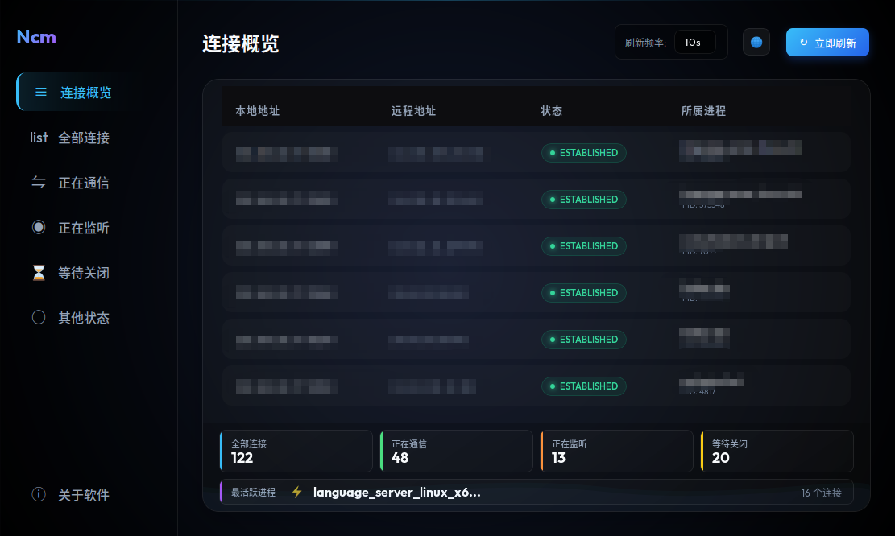

# Ncm (Network Connection Monitor)

Ncm 是一个轻量级、跨平台的电脑网络连接监控软件。它能够实时显示当前系统的活动网络连接、监听端口及其对应的进程信息，帮助用户及时发现异常的网络请求。

## ✨ 功能特性

- **实时代号**: 能够捕获 TCP/UDP 网络连接状态。
- **进程关联**: 自动关联网络连接对应的进程 ID (PID) 和进程名称。
- **智能过滤**: 默认过滤本地 Unix Socket 干扰，专注于真实的 IP 网络活动。
- **现代化 UI**: 采用玻璃拟态 (Glassmorphism) 设计风格，支持暗色模式。
- **多语言**: 内置中/英双语切换支持。
- **跨平台**: 基于 Go + Wails 开发，支持 Windows, macOS 和 Linux。

## 📸 界面预览



## 🛠️ 技术栈

- **Backend**: Go (Golang)
- **Scanning**: [gopsutil](https://github.com/shirou/gopsutil)
- **Frontend**: HTML5, CSS3 (Vanilla), JavaScript
- **Framework**: [Wails](https://wails.io/)

## 🚀 快速开始

### 前置要求

- Go 1.18+
- [Wails](https://wails.io/docs/gettingstarted/installation) (用于构建 GUI 版本)
- **Linux 用户额外依赖**:
  ```bash
  sudo apt update
  sudo apt install libgtk-3-dev libwebkit2gtk-4.0-dev
  ```

### 命令行预览 (无需 Wails)

如果您只想测试后端的扫描引擎逻辑：

```bash
# 获取依赖
go mod tidy

# 运行测试脚本
go run test_scanner.go
```

这将在终端输出当前的网络连接列表。

### 方式二：使用 Docker 构建（推荐）

如果您的本地环境遇到了依赖安装问题，或者需要**同时生成 Linux 和 Windows** 的可执行文件，请使用 Docker 构建：

```bash
./build_docker.sh
```

这将自动配置环境并在 `build/bin/` 目录下生成：
- `ncm-linux`: Linux 可执行文件
- `ncm-windows.exe`: Windows 可执行文件

### 方式三：手动构建（Linux）

*注：确保已安装 Wails 环境。*

```bash
# 开发模式运行
wails dev

# 构建生产版本
wails build
```

## 📂 目录结构

```
.
├── docs/               # 文档与设计素材
├── frontend/           # 前端资源 (HTML/CSS/JS)
├── network/            # 后端核心扫描逻辑
│   └── scanner.go
├── test_scanner.go     # 命令行测试工具
├── go.mod              # Go 依赖管理
└── README.md           # 项目说明文档
```

## 📝 许可证

MIT License
