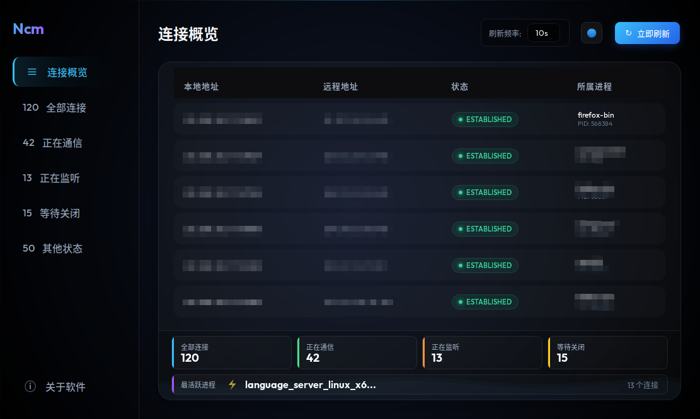

# 电脑连接监控软件 (Ncm) 设计方案

本方案旨在开发一个轻量级、跨平台的电脑连接监控软件。用户可以通过该软件实时查看所有的网络连接（TCP/UDP）、监听端口以及远程 IP 地址，以便及时发现潜在的恶意网络连接。

## 技术选型

- **后端语言**: Go (Golang) - 具备优秀的并发处理能力和跨平台编译支持。
- **网络信息获取**: `github.com/shirou/gopsutil/v3/net` - 成熟的系统信息获取库，支持 Windows, macOS, Linux。
- **UI 框架**: [Wails](https://wails.io/) - 允许使用 Go 编写后端，前端使用标准 Web 技术（HTML/CSS/JS），最终打包成单个二进制文件。
- **UI 设计风格**: 现代暗色模式，采用玻璃拟态（Glassmorphism）设计，支持动态平滑刷新。界面标题与按钮默认显示**中文**。
- **多语言适配**: 采用前端 i18n 方案，支持中英文动态切换。

## UI 原型图示例

## 拟解决的问题

- 实时显示当前电脑所有已建立的连接（ESTABLISHED）。
- 显示监听状态（LISTEN）的端口及其进程信息。
- 提供简单易读的界面，过滤不必要的本地环回连接。
- 支持跨操作系统运行。

## 提议的变更

### [后端组件]

#### [NEW] main.go
主程序入口，负责初始化 Wails 窗口和注册后端服务。

#### [NEW] network/scanner.go
封装 `gopsutil` 调用，定期扫描系统网络状态并返回结构化数据（IP, Port, Status, PID, Process Name）。

### [前端组件]

#### [NEW] frontend/index.html
主界面结构，定义监控指标列表区域。

#### [NEW] frontend/style.css
应用玻璃拟态设计风格，包括：
- 半透明背景与毛玻璃效果。
- 动态过渡动画。
- 清晰的 IP 和端口展示布局。

#### [NEW] frontend/app.js
负责从后端获取数据并动态更新 DOM，内置多语言翻译映射表。

## 验证计划

### 自动化测试
- 编写 Go 单元测试，验证 `network/scanner.go` 在不同平台下能否正确获取网络连接列表。
    - `go test ./network/...`

### 手动验证
- 在 Linux 环境下运行并对比 `netstat -tunlp` 的结果。
- 观察 UI 是否能随着网络状态的变化动态刷新。
- 确认点击刷新频率调整等交互功能是否正常工作。
